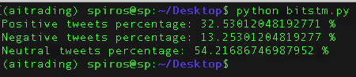

# bitcoinsentiment
A simple bitcoin sentiment analyzer

References:

* https://medium.com/@BlockchainEng/crypto-trading-bot-sentiment-analysis-bot-bfbd8dd1df5a
* https://www.geeksforgeeks.org/twitter-sentiment-analysis-using-python/





# How to run

To run, create a Twitter app from the development API and copy the values of the keys https://developer.twitter.com/:

```
consumer_key = ''
consumer_secret = ''
access_token = ''
access_token_secret = ''
```

Run:
```
python bitcoin.py
```
